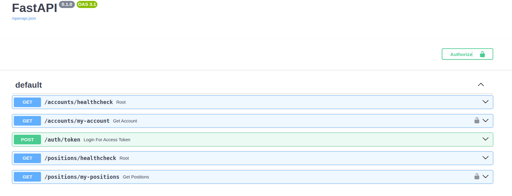

# Investments platforms

You can find this API running in an AWS lightsail instance in this address: https://alzdev.org/docs

This is a mocked project to simulate a platform for investors. That being said, have those points
in consideration:

* There are things here that would not fit in a production enviroment, such as env file be uploaded in the githutb repository
* In production is better to have a separate docker compose file
* Due some personal factors, I start to do this project some days after the start date, for that tests were not made to fit in the deadline
* The stock value is fetched by an external service (yfinances), if the system is not able to fetch this value the last price of the stock will be showed
* The ideal is that we could use celery beat in a way that periodically all stock price were fetched
  
  
# How to test

For this explanation we gonna use the running API in alzdev.org/docs but you can do the same locally. To run locally you have to follow the instructions in this readme file

    1. Go to https://alzdev.org/docs
    2. Go in /accounts/my-account section but dont try to execute yet
    3. Click in the padlock symbol and fill ONLY the username and password fields following the next step
    4. The username in that case is the account's CPF number. You can use username = 23456789012 and password = mypass  
    5. Now you can execute this endpoint, if things go well you will be able to see the account's info
    6. If you logged you can go straight to /positions/my-position and check the positions associated with the account. If any problem related to authentication happens try to login again and be aware that the jwt token has expiration
    



## Tasks checklists

- [x] Adjust the readme
  - [x] Explain how start the server
  - [x] Explain how initiate database
  - [x] Explain how to test the endpoints
  - [x] Put some picture
- [x] Create a makefile to initiate database
- [x] Clean the code
- [x] Implement authentication
- [x] Endpoint to see user account
- [x] Endpoint to see account's position
- [x] AWS hosting
- [x] Create a mocked database
- [ ] (Maybe) Create tests 
- [x] HTTPS certified
- [ ] CPF as unique -> OUT OF THE DEADLINE
- [ ] Create an cache -> OUT OF THE DEADLINE

## Requirements

- Make (for managing commands)

## Project Setup

1. Clone this repository:

    ```bash
    git clone https://github.com/andreluiz27/investment_platform.git
     ```

2. Run the makefile to start the api and the databse check before if the ports used in compose are opened, if not, make sure to open or change the ports

    ```bash
    make api
    ```
3. Run the make command to create the database

    ```bash
    make init-database:
    ```
4. Load a mocked database
    ```bash
    make load-mocked-db:
    ```
5. Go to localhost:8000/docs and check if things are running well


